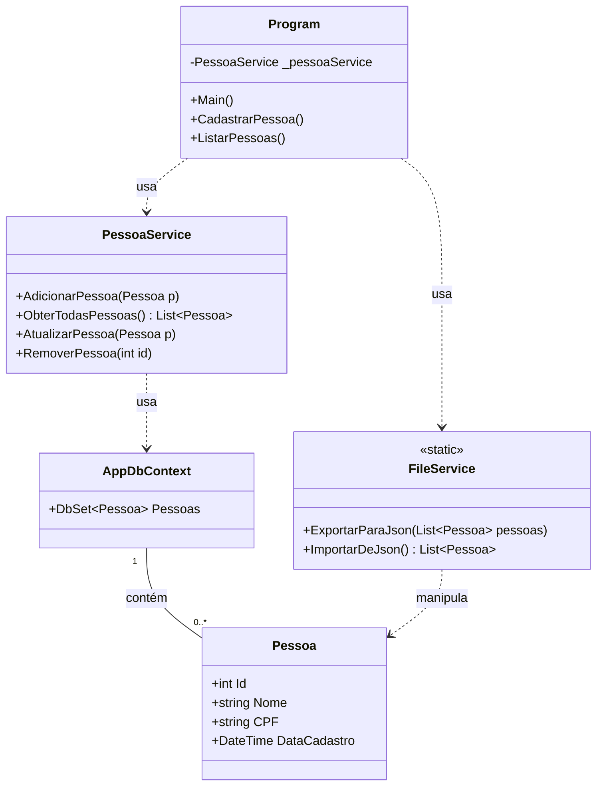

# Sistema de Mitigação de Vício em Apostas

Este projeto é uma aplicação de console desenvolvida em C# com .NET para gerenciar um cadastro de pessoas. O sistema implementa funcionalidades de CRUD (Create, Read, Update, Delete), armazena os dados em um banco de dados SQLite e permite a importação/exportação de dados em formato JSON.

## Principais Funcionalidades

- **Cadastro de Pessoas**: Adiciona novos indivíduos ao banco de dados.
- **Listagem Completa**: Exibe todos os registros cadastrados.
- **Atualização de Dados**: Permite modificar o nome e o CPF de uma pessoa existente.
- **Remoção de Pessoas**: Exclui um registro do sistema pelo ID.
- **Persistência de Dados**: Utiliza o Entity Framework Core com um banco de dados SQLite (`banco_apostas.db`).
- **Exportação e Importação**: Salva os dados em um arquivo `pessoas.json` e permite a importação a partir do mesmo.

## Arquitetura

O projeto segue uma arquitetura em camadas para separar as responsabilidades, garantindo um código mais limpo, organizado e de fácil manutenção.


### Diagrama de Classes Simplificado



## Tecnologias Utilizadas

- **.NET / C#**: Plataforma e linguagem de programação.
- **Entity Framework Core**: ORM para mapeamento objeto-relacional.
- **Microsoft.EntityFrameworkCore.Sqlite**: Provedor para o banco de dados SQLite.
- **SQLite**: Banco de dados relacional local baseado em arquivo.
- **Newtonsoft.Json**: Biblioteca para manipulação de arquivos JSON.

## Estrutura de Arquivos

```
/
|-- Data/
|   |-- AppDbContext.cs
|   `-- Migrations/
|-- Models/
|   `-- Pessoa.cs
|-- Services/
|   |-- FileService.cs
|   `-- PessoaService.cs
|-- banco_apostas.db
|-- pessoas.json
|-- Program.cs
`-- SeuProjeto.csproj
```

## Como Compilar e Executar

Siga os passos abaixo para configurar e executar o projeto em seu ambiente local.

### Pré-requisitos

- [.NET SDK](https://dotnet.microsoft.com/download) (versão 6.0 ou superior) instalado.

### Passo a Passo

1.  **Clone o repositório:**
    ```bash
    git clone [https://github.com/seu-usuario/seu-repositorio.git](https://github.com/seu-usuario/seu-repositorio.git)
    cd seu-repositorio
    ```

2.  **Restaure as dependências do projeto:**
    O .NET irá baixar e instalar todos os pacotes definidos no arquivo `.csproj`.
    ```bash
    dotnet restore
    ```

3.  **Configure o banco de dados com o Entity Framework Core:**
    Estes comandos preparam o banco de dados SQLite pela primeira vez.
    ```bash
    # Instala a ferramenta de linha de comando do EF (se ainda não tiver)
    dotnet tool install --global dotnet-ef

    # Cria a "receita" (migração) para o banco de dados com base no modelo Pessoa.cs
    dotnet ef migrations add InitialCreate

    # Executa a migração para criar o arquivo de banco de dados e suas tabelas
    dotnet ef database update
    ```

4.  **Execute a aplicação:**
    ```bash
    dotnet run
    ```
    O menu interativo será exibido no seu terminal.

## Funcionalidades do Menu

| Opção | Ação                                         |
| :---- | :------------------------------------------- |
| **1** | **Cadastrar nova pessoa**: Solicita Nome e CPF e salva no banco. |
| **2** | **Listar todas as pessoas**: Exibe todos os registros do banco. |
| **3** | **Atualizar dados**: Busca uma pessoa por ID e permite alterar seu nome e/ou CPF. |
| **4** | **Remover uma pessoa**: Busca uma pessoa por ID e a remove do banco. |
| **5** | **Exportar dados para JSON**: Salva todos os registros no arquivo `pessoas.json`. |
| **6** | **Importar dados de JSON**: Lê o arquivo `pessoas.json` e adiciona os registros ao banco. |
| **7** | **Sair**: Encerra a aplicação.                   |
